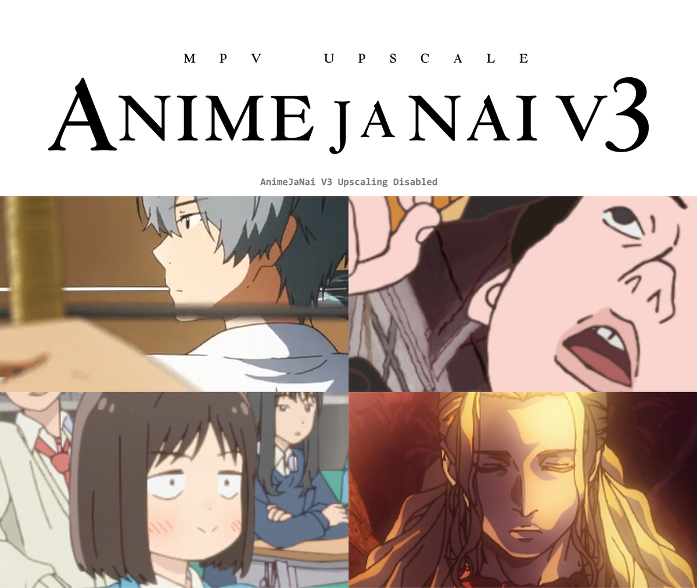

# Upscaling Anime in mpv with 2x_AnimeJaNai V3

  
  
(click image to enlarge)

## Overview

This project provides a collection of Real-ESRGAN Compact ONNX upscaling models, along with a custom build of mpv video player. The video player (currently Windows only), enables real-time upscaling of 1080p content to 4K by running these models using TensorRT (NVIDIA only). While the default configuration upscales using the 2x_AnimeJaNai V2 models, it can be easily customized to utilize any Real-ESRGAN Compact ONNX models.

Samples: https://slow.pics/c/V3GkBJyR

Join the [**AnimeJaNai Discord server**](https://discord.gg/EeFfZUBvxj) to get the latest news, download pre-release and experimental models, get support and ask questions, share your screenshots (use the `s` key in mpv), or share your feedback. 日本語も大丈夫です。

## Usage Instructions
Ensure your NVIDIA graphics drivers are up to date. Download and extract the [latest release archive](https://github.com/the-database/mpv-upscale-2x_animejanai/releases) of mpv-upscale-2x_animejanai. Open the video player at `mpvnet.exe` to use [mpv.net](https://github.com/mpvnet-player/mpv.net) or `mpv.exe` to use plain [mpv](https://github.com/mpv-player/mpv) depending on your preference. 

When playing a video for the first time, a TensorRT engine file will be created for the selected ONNX model. Playback will be paused and a command prompt box will open. Please make sure to wait while the engine is created. Engine creation only needs to happen once per model. Playback will resume on its own when finished.

The player is preconfigured to upscale with 2x_AnimeJaNai_V2, and makes 6 upscaling profiles available by default. The available models and their respective profiles are described in more detail below. Any of these profiles can be selected on the fly using the keybinding listed below. 

|Model | Description | Profile | Keybinding | Minimum recommended GPU for upscaling 1080p to 4k |
|-|-|-|-|-|
|Compact | Highest quality model | `upscale-on-compact4x`| `Shift+1` | RTX 4090|
|||`upscale-on-compact2x`|`Shift+4`||
|UltraCompact | High quality model which trades slight quality for major performance gains | `upscale-on-ultracompact4x` | `Shift+2` | RTX 3080|
|||`upscale-on-ultracompact2x`|`Shift+5`||
|SuperUltraCompact | Fastest performance model which sacrifices a bit more quality | `upscale-on-superultracompact4x` | `Shift+3` | RTX 3060?|
|||`upscale-on-superultracompact2x`|`Shift+6`||

Comparisons between Compact, UltraCompact, and SuperUltraCompact models: https://slow.pics/c/V3GkBJyR

The 2x and 4x profiles behave the same on HD videos, but the 4x profiles will run the models twice on SD videos and produce a sharper result. 

The default upscaling profile is set up to use the UltraCompact model with the profile name `upscale-on-ultracompact4x`. The default upscaling profile is specified in `mpv-upscale-2x_animejanai/portable_config/mpv.conf`. To change the default profile, edit the `mpv.conf` file and change the `profile=upscale-on-ultracompact4x` line to a profile name from the above table based on your hardware requirements and preferences.

The upscaling can be further customized using the configuration file for AnimeJaNai which is located at `mpv-upscale-2x_animejanai/portable_config/shaders/animejanai_v2.conf`. The configuration file allows the setup of up to 9 custom slots and also the use of custom chains, conditional settings based on video resolution and framerate, downscaling to improve performance, and more. All available settings are described in more detail in the config file. More information on custom configurations will be available on the wiki soon. The custom slots can be activated with keybindings `Ctrl+1` through `Ctrl+9`. To use one of these custom slots as the default upscaler, set the appropriate profile name corresponding to the desired slot in mpv.conf, such as `profile=upscale-on-1`.

All keybindings can be customized by editing lines near the bottom of the `mpv-upscale-2x_animejanai/portable_config/input.conf` file. By default, AnimeJaNai upscaling can be turned off using the `Ctrl+0` keybinding.

All other mpv settings can be configured by editing `mpv-upscale-2x_animejanai/portable_config/mpv.conf` (see the [mpv manual](https://mpv.io/manual/stable/) for all options) for mpv options or `mpv-upscale-2x_animejanai/portable_config/input.conf` for mpv keybindings. 

By default, screenshots can be taken with the `s` key and are stored in `mpv-upscale-2x_animejanai/portable_config/screenshots`. 

## 2x_AnimeJaNai Models
The 2x_AnimeJaNai models are a collection of real-time 2x Real-ESRGAN Compact, UltraCompact, and SuperUltraCompact models designed specifically for doubling the resolution of HD and SD models. 

### 2x_AnimeJaNai HD V3 Models

Most HD anime are [not produced in native 1080p resolution](https://guide.encode.moe/encoding/descaling.html) but rather have a production resolution between 720p and 1080p. When the anime is distributed to consumers via TV broadcast, web streaming, or home video, the video is scaled up to 1080p, leading to scaling artifacts and a loss of image clarity in the source video. The aim of these models is to address these scaling and blur-related issues while upscaling to deliver a result that appears as if the anime was originally mastered in 4K resolution.

The development of the V3 models spanned over five months, during which over 100 release candidate models were trained and meticulously refined. The V3 models introduce several notable improvements compared to their V2 counterparts, including:
- More faithful appearance to original source
- Improved handling of oversharpening artifacts 
- Better at preserving intentional blur in scenes using depth of field
- More accurate line colors, darkness, and thickness
- Better preservation of soft shadow edges

Overall, the V3 models yield significantly more natural and faithful results compared to the V2 models. 

### 2x_AnimeJaNai SD V1 Models

2x_AnimeJaNai SD V1 models are in developmnent. The latest release of mpv-upscale-2x_animejanai includes prerelease models for 2x_AnimeJaNai SD V1. While the 2xAnimeJaNai HD models can work well for some SD sources, those models were specifically trained to upscale HD anime and don't always work well for SD sources. The SD models are designed to upscale SD anime to appear as if the anime was mastered in HD resolution. With sufficient hardware, these models can be stacked with the HD models to upscale SD anime to 4k resolution. 

## Benchmarks
[Benchmarks](https://github.com/the-database/mpv-upscale-2x_animejanai/wiki/Benchmarks) for various hardware configurations tested against various upscaling configurations are available on the wiki. 

## Support for Other Media Players
Any media player which supports external DirectShow filters should be able to run these models, by using [avisynth_filter](https://github.com/CrendKing/avisynth_filter) to get VapourSynth running in the video player. 

## Prerendering Videos using Other Graphics Cards
The 2x_AnimeJaNai_V2 ONNX models can be used on a PC with any graphics card to render upscaled videos, even when using graphics cards not fast enough for realtime playback. Please see the [AnimeJaNaiConverterGui](https://github.com/the-database/AnimeJaNaiConverterGui) project to create upscaled video files using a Windows GUI. Or for creating upscaled videos with the Windows command line, please see the file `shaders/animejanai_v2_encode_single.bat` or `shaders/animejanai_v2_encode_batch.bat` included in the release package. Other options include [chaiNNer](https://github.com/chaiNNer-org/chaiNNer) or [VSGAN-tensorrt-docker](https://github.com/styler00dollar/VSGAN-tensorrt-docker), which are multiplatform options for Windows and non-Windows users.

The TensorRT backend is recommended for NVIDIA users for fastest rendering performance. AMD users should use the DirectML or NCNN backend instead. Templates for chaiNNer are available for [NVIDIA](animejanai-nvidia.chn?raw=1) and [AMD](animejanai-amd.chn?raw=1) users. Simply download and open the appropriate `chn` file in chaiNNer, and select the ONNX model file and the input video file to upscale. 

## Related Projects
- [MangaJaNai](https://github.com/the-database/mangajanai): Upscale manga with ESRGAN models
- [AnimeJaNaiConverterGui](https://github.com/the-database/AnimeJaNaiConverterGui): Windows GUI for upscaling with extremely fast performance

## Acknowledgements
- [Upscale Wiki](https://upscale.wiki/wiki/Main_Page) and associated Discord server
- [422415](https://github.com/422415) for significant assistance in dataset preparation and continuous feedback during development of V2 models
- Community feedback on V1 models
- [MPV_lazy](https://github.com/hooke007/MPV_lazy) and [vs-mlrt](https://github.com/AmusementClub/vs-mlrt)
- [traiNNer-redux](https://github.com/joeyballentine/traiNNer-redux)
- [Dataset Destroyer](https://github.com/Kim2091/helpful-scripts/tree/main/Dataset%20Destroyer)
- [Real-ESRGAN](https://github.com/xinntao/Real-ESRGAN)
- [OpenModelDB](https://openmodeldb.info/)
- [getnative](https://github.com/Infiziert90/getnative) and [anibin](https://anibin.blogspot.com/)
